<div align="center">


**A routed, wiki-linked knowledge graph that lints like code.**

*An engram is the physical trace a memory leaves in a brain. This one lives in your repo.*

[](https://github.com/geektechniquestudios/engram/actions/workflows/ci.yml)
[](LICENSE)
[](scripts/)
[](docs/HARNESSES.md)



*The shape a mature vault takes: every dot a doc, every line a `[[wiki-link]]`, every color a knowledge base.<br>Engram is the extracted skeleton of a system running at 3,800+ docs, 29 research KBs, and 386 section hubs — still routed by one ≤200-line index.*

</div>

---

Coding agents have working memory (the context window) and no long-term memory. The session ends, the weights don't change, and everything learned is gone: the architecture, the conventions, the fix that took four hours, the correction you gave three times.

Engram adds the missing store as a **routed knowledge graph** in your repo:

- **A router, always loaded.** ≤200 lines of trigger tables — "encounter X → read Y". Ambient cost ~5k tokens, and it stays flat no matter how large memory grows.
- **A vault, loaded on match.** Wiki-linked markdown knowledge bases, three tiers deep. Retrieval is deterministic — router row → meta-analysis → hub → doc, ≤3 hops — with no embeddings, no vector database, no index server.
- **A pipeline, not a pile.** The `/research` skill grows new KBs; cross-synthesis links them into what the vault already knows; abstraction rolls the links up into decision guidance with an explicit expiry condition.
- **Linters, wired into CI.** Eleven vault checks and six router checks. Broken links, orphans, drifted doc-counts, unreachable KBs — memory rot fails your PR exactly like a failing test.

Everything is plain markdown in git: versioned, reviewable in PR diffs, and shared across machines, branches, agents, and teammates for free.

## Install by pasting

Open your agent **inside your project** (Claude Code, Codex, Cursor, or anything that can run shell commands and read files) and paste this:

```text
Set up the Engram memory system in this project.

1. Clone https://github.com/geektechniquestudios/engram into a scratch
   directory OUTSIDE this repo (it is only the template source).
2. Read BOOTSTRAP.md in the clone, top to bottom, and follow it exactly.
3. It will have you interview me first. Do that before writing anything.
4. Install into THIS repo, explain each piece as you create it, and do not
   finish until both linters pass and you have given me the cheat sheet.
```

That is the whole install. The agent clones this repo, walks a phased runbook ([`BOOTSTRAP.md`](BOOTSTRAP.md)), interviews you for five minutes about your project, then builds your memory system around your answers: skeleton, instruction wiring, router, and your first two knowledge bases, seeded from what you told it. It explains every piece as it goes and finishes only when the linters are green.

Prefer to see every move before it happens? There is a [manual quick start](#manual-quick-start) below.

## Four ways a lookup lands

<div align="center">

</div>

Retrieval is routing, not search — and the routes have shapes:

1. **Drill-down** — router row → meta-analysis → section hub → doc. Three hops is the worst case at any vault size; the three-tier structure *is* the search algorithm. Watch the demo: "how many namespaces are in dev-east?" never triggers "what's dev-east? how do I connect?" — the row fires on your own shorthand and lands on the runbook: the AWS auth command, the SSM tunnel, then the query.
2. **Deep link** — rows can point straight at a doc. Hot paths get flatter over time.
3. **Cross-KB synthesis** — wiki-links bridge knowledge bases, so one read joins what two domains each half-know.
4. **Episodic** — "didn't we try this before?" routes into the session archive, where the *why* behind past decisions survives the context window that produced it.

Same trigger, same doc, every time. A bad retrieval is a bad row you can see and edit in a diff — not a similarity score you can't.

## Four surfaces, two speeds

<div align="center">

</div>

The core token-economics trick: **what loads every session must stay thin; what is deep must cost nothing until needed.**

| Surface | Where | Loaded | Holds |
|---|---|---|---|
| **1 · Instructions** | `CLAUDE.md` / `AGENTS.md` + path-scoped rules | every session | non-negotiable rules, conventions, commands |
| **2 · Router** | harness memory (`MEMORY.md`, ≤200 lines) | every session | trigger tables: "encounter X → read Y" |
| **3 · Vault** | `docs/vault/` in your repo | on routed match | KBs, meta-analyses, hubs, deep docs |
| **4 · Session archive** | `docs/vault/Session-Archive/` | rarely | episodic history: decisions, failures, the *why* |

The router never *contains* knowledge; it contains **pointers with trigger conditions**. Anything the router can reach in one read, the vault holds at whatever depth the subject deserves.

## Inside the vault

Knowledge lives in **knowledge bases** (KBs), each a directory with a three-tier shape:

```
Payments-Domain/
├── Payments Domain - Meta-Analysis.md   ← tier 1: entry point & decision router
├── 01-Billing-Core/
│   ├── Billing Core - Section Hub.md    ← tier 2: thematic cluster, reading order
│   ├── Subscription Lifecycle.md        ← tier 3: deep docs that LEAD with the answer
│   └── Dunning and Retries.md
└── 02-Provider-Integration/
    └── ...
```

- **Meta-analysis** answers "which section do I need?" with a question-keyed *How to use this KB* table.
- **Section hubs** cluster related docs and say what connects them.
- **Docs** open with the answer, then the evidence.

The tiers give you the ≤3-hop guarantee; the **cross-links** give you the graph. The vault is an Obsidian-compatible vault by construction — `[[wiki-links]]` are the edges, and the graph view at the top of this page is what a healthy one looks like: per-KB clusters, hubs raying outward, and a dense web of links *between* clusters. Obsidian itself is optional (everything is plain markdown); the shape is not — the linter rejects orphan docs, solitary docs, and unreachable KBs, so the graph stays connected by contract. [`docs/KB-GUIDE.md`](docs/KB-GUIDE.md) covers what deserves a KB and how to grow one without it rotting.

## Knowledge that compounds

<div align="center">

</div>

A vault that only accumulates notes is a library. Engram's write path is a pipeline, and each stage has its own skill and its own linter checks:

1. **Research produces a KB.** `/research <topic>` starts from the decision the research is *for*, gathers evidence (primary docs, your codebase, your head), and builds a three-tier KB whose executive summary is 3–5 claims — not a table of contents. Every KB is registered in `Research Library.md`, so the registry reads as a list of things the project has learned.
2. **Cross-synthesis connects it.** The new KB is linked both ways into its nearest neighbors: confirmations, contradictions, constraints. Where two KBs jointly answer a question neither answers alone, a **synthesis doc** captures the joint answer. This is why the graph is a web rather than a forest — the cross-links are where compound knowledge lives.
3. **Abstraction turns it into doctrine.** The synthesis rolls up into the motive: "given our constraints, do X; revisit if Y changes" lands in the meta-analysis, a router row makes it ambient if it changes default behavior, and a **falsifier** records what observation would expire it. Doctrine without an expiry condition is dogma.

The animation above is that lifecycle across three KBs: a routed read heats exactly the docs a task needs, synthesis draws new edges between KBs, and the integrity scan flips rot green.

## Memory that lints

Trusting memory is the whole game, and trust needs verification. Engram ships two zero-dependency linters, wired into CI by the bootstrap:

```console
$ node scripts/vault-check.mjs
engram vault-check · 214 docs · docs/vault

2 error(s):
  ✗ broken link: [[Dunning and Retires]] in Payments-Domain/01-Billing-Core/Subscription Lifecycle.md
  ✗ duplicate title "Rate Limiting": Payments-Domain/… · Operations/… — wiki-links resolve ambiguously

4 warning(s):
  ⚠ stale count "kb:Payments-Domain" in Research Library.md: 11 → 12 (run --fix)
  ⚠ orphan doc (nothing links to it): Operations/Old Incident Notes.md
  ⚠ solitary doc (no outgoing wiki-links — weave it into the graph): Operations/Deploy Checklist.md
  ⚠ KB "Search-Infrastructure" is not reachable from an entry point (00-Index / Research Library)
```

`vault-check.mjs` runs eleven checks: broken wiki-links, ambiguous titles, orphan docs, solitary docs, hub coverage, missing meta-analyses, entry-point reachability, archive-index coverage, stub docs, leftover placeholders, and stale count directives. Doc counts in your indexes are wrapped in `<!-- count:… -->` markers and verified against the filesystem — `--fix` rewrites them in place, so the numbers in your docs are checked facts, not aspirations. `validate-memory.sh` checks the *router* side: line budget, dead pointers, orphan topic files, and the frontmatter contract. A memory edit that would strand your agent fails your PR, exactly like a broken test. The failure modes these guard against (and the monthly audit habit) are in [`docs/MAINTENANCE.md`](docs/MAINTENANCE.md).

## What lands in your repo

```
your-project/
├── CLAUDE.md / AGENTS.md          ← memory protocol appended (existing content untouched)
├── engram.config.json             ← linter config (vault path, budgets, frontmatter contract)
├── scripts/
│   ├── vault-check.mjs            ← vault linter · Node ≥18, stdlib only
│   └── validate-memory.sh         ← router linter · bash + coreutils
├── docs/vault/
│   ├── 00-Index.md                ← vault entry point: task → doc routing
│   ├── Research Library.md        ← registry of every KB (with checked doc-counts)
│   ├── Engram-Memory-System/      ← the system documenting itself (working example KB)
│   ├── <Your-First-KB>/           ← seeded from your interview during bootstrap
│   └── Session-Archive/           ← one entry per significant session
└── .claude/                       ← Claude Code only
    ├── rules/                     ← path-scoped rules (auto-load when files match)
    └── skills/                    ← /archive-session · /new-kb · /research · /memory-maintenance
```

Plus, on the harness side, a `MEMORY.md` router installed into your agent's auto-loaded memory. The vault ships with one real KB — **Engram documenting Engram** — so you always have a live example of every structure, three tiers and all.

Day-to-day, the loop is: work normally → the agent hits something worth keeping → it writes a doc and a router row → `/research` when a topic deserves a whole KB → `/archive-session` captures the *why* before the context dies → CI keeps every link honest.

## Manual quick start

```bash
git clone https://github.com/geektechniquestudios/engram
cd your-project

# 1. copy the skeleton
cp -R ../engram/template/vault docs/vault
cp ../engram/template/engram.config.json .
mkdir -p scripts && cp ../engram/scripts/vault-check.mjs ../engram/scripts/validate-memory.sh scripts/

# 2. wire your instruction file
cat ../engram/template/CLAUDE-SECTION.md >> CLAUDE.md     # or AGENTS-SECTION.md >> AGENTS.md

# 3. install the router
#    Claude Code: seed MEMORY.md in your project's auto-memory dir from
#    template/MEMORY.template.md, then fill the {{PLACEHOLDERS}}

# 4. verify
node scripts/vault-check.mjs
bash scripts/validate-memory.sh
```

Then read [`docs/SPEC.md`](docs/SPEC.md) (the full architecture: budgets, contracts, write-paths) and [`docs/KB-GUIDE.md`](docs/KB-GUIDE.md) (building KBs worth routing to). The guided bootstrap does all of this for you, plus the interview and your first two KBs.

## Works with

| Harness | Level | Notes |
|---|---|---|
| **Claude Code** | first-class | auto-memory router, path-scoped rules, four skills, `#` quick-add |
| **Codex / Jules / Amp** (AGENTS.md readers) | full | protocol via `AGENTS-SECTION.md`; router embedded in repo |
| **Cursor** | full | protocol via `.cursor/rules` |
| **Anything else** | minimum viable | one instruction block + the vault; see [`docs/HARNESSES.md`](docs/HARNESSES.md) |

The vault and session archive are plain markdown in git, so they are shared across every machine, branch, teammate, and agent for free. Only the thin router is harness-local, and it is rebuildable from the vault.

## FAQ

**Why not embeddings / RAG?**
Retrieval here is *routing*: a human-readable index consulted by the agent's own reasoning. It is deterministic (same trigger, same doc), debuggable (a bad retrieval is a bad row you can edit), versioned (memory changes show up in PR diffs), and it needs zero infrastructure. Attention over a good index beats similarity search over a doc soup at any scale a repo can reach.

**Do I need Obsidian?**
No. Everything is plain markdown with `[[wiki-links]]`. Obsidian gives you a free graph view of your agent's brain — genuinely useful for spotting orphan clusters and thin spots, and it looks like the top of this page — but nothing depends on it.

**What does it cost per session?**
Roughly 5k tokens ambient (instructions + router). The vault costs nothing until a row routes into it, and then you pay for exactly the docs the task needed. That is the point of the two-speed design: knowledge grows unbounded while the per-session tax stays flat.

**Does my data go anywhere?**
It is files in your repo. Nothing phones home, nothing is uploaded, there is no service. The linters run on Node and bash stdlib.

**How is this different from just writing a NOTES.md?**
Structure and verification. A flat file has no retrieval story past ~200 lines and no defense against rot. Engram gives knowledge a shape agents can navigate (router → meta-analysis → hub → doc), a pipeline that compounds it (research → synthesis → doctrine), and linters that fail CI when memory lies.

**Where did this come from?**
Engram is the extracted skeleton of the memory system running a production venture-studio monorepo, where it grew to ~3,800 vault docs across 29 research KBs and 386 section hubs — maintained by multiple agents working parallel branches — while keeping the always-loaded footprint at ~5k tokens. The patterns here are the ones that survived contact; [`docs/SPEC.md`](docs/SPEC.md) is the distillation.

---

<div align="center">

MIT © 2026 [Geektechnique Studios](https://github.com/geektechniquestudios) · [Spec](docs/SPEC.md) · [KB Guide](docs/KB-GUIDE.md) · [Maintenance](docs/MAINTENANCE.md) · [Harnesses](docs/HARNESSES.md) · [Contributing](CONTRIBUTING.md)

*Built by agents, for agents, supervised by humans who got tired of repeating themselves.*

</div>
