<div align="center">


**A self-correcting memory fabric for coding agents: an Obsidian-based knowledge graph that stays light in context, lints like code, and grows through research.**

[](https://github.com/geektechniquestudios/engraven/actions/workflows/ci.yml)
[](LICENSE)
[](src/)
[](scripts/)
[](docs/HARNESSES.md)


*Every dot is a doc, every line is a `[[wiki-link]]`, every color is a knowledge base.<br>Engraven is the extracted skeleton of a real system that grew to roughly 3,800 docs, 29 research KBs, and 386 section hubs, still routed by one index under 200 lines.*

</div>

---

Coding agents forget everything between sessions. The context window closes, and the architecture, the conventions, and the fix that took four hours are gone. Next week you explain them again.

Engraven fixes that with files in your repo. A small router loads every session and says "when you hit X, go read Y". It points into a vault of wiki-linked markdown knowledge bases, so retrieval is deterministic, takes at most three hops, and needs no embeddings, no vector database, and no index server.

A research skill grows the vault, synthesis welds new knowledge into what is already there, and two linters fail CI the moment memory rots. Because everything is plain markdown in git, memory is versioned, reviewable in PR diffs, and shared across machines, branches, agents, and teammates.

## Install

**Claude Code, the short way.** Engraven ships as a plugin:

```text
/plugin marketplace add geektechniquestudios/engraven
/plugin install engraven@engraven
/engraven:bootstrap
```

The bootstrap interviews you for five minutes, then builds the memory system around your answers: skeleton, instruction wiring, router, and your first two knowledge bases. It explains every piece as it goes and finishes only when both linters pass. Later, `/engraven:doctor` health-checks the install.

**Any agent, by pasting.** Open your agent inside your project (Codex, Cursor, or anything that can run shell commands and read files) and paste this:

```text
Set up the Engraven memory system in this project.

1. Clone https://github.com/geektechniquestudios/engraven into a scratch
   directory OUTSIDE this repo (it is only the template source).
2. Read BOOTSTRAP.md in the clone, top to bottom, and follow it exactly.
3. It will have you interview me first. Do that before writing anything.
4. Install into THIS repo, explain each piece as you create it, and do not
   finish until both linters pass and you have given me the cheat sheet.
```

**By hand.** Prefer to see every move before it happens? Use the [manual quick start](#manual-quick-start) below.

### What it needs

- **git and a repo.** That is the whole platform. No database, no embeddings, no service, and nothing phones home.
- **One way to run the checks.** Either the `engraven` CLI, a single Rust binary from [Releases](https://github.com/geektechniquestudios/engraven/releases) (or `cargo install --git https://github.com/geektechniquestudios/engraven`), or the bundled scripts: `vault-check.mjs` on Node 18+ with zero packages, `validate-memory.sh` on bash. Same checks, same output, verified by a parity gate in this repo's CI.
- **No Rust toolchain needed.** The bootstrap wires your CI to prefer the binary (a small static download on the runner) and fall back to the vendored scripts automatically.
- **Obsidian is optional.** The vault is an Obsidian vault by construction, but it is all plain markdown; the app just gives you the graph view of it.

## Four ways a lookup lands

<div align="center">

</div>

Retrieval is routing, not search, and the routes have shapes:

1. **Drill-down.** Router row to meta-analysis to section hub to doc. Three hops is the worst case at any vault size; the three-tier structure is the search algorithm. In the demo, "how many namespaces are in dev-east?" never stalls on "what is dev-east? how do I connect?". The row fires on your own shorthand and lands on the runbook: the AWS auth command, the SSM tunnel, then the query.
2. **Deep link.** Rows can point straight at a doc. Hot paths get flatter over time.
3. **Cross-KB synthesis.** Wiki-links bridge knowledge bases, so one read joins what two domains each half-know.
4. **Episodic.** "Didn't we try this before?" routes into the session archive, where the why behind past decisions survives the context window that produced it.

Same trigger, same doc, every time. A bad retrieval is a bad row you can see and edit in a diff, not a similarity score you cannot.

## Four surfaces, two speeds

<div align="center">

</div>

The demo is three sessions back to back, with both speeds visible at once. The left side clears and reloads the same thin surfaces every session, about 5k tokens, flat. The right side never resets: session one pulls a payments doc (+1.4k), session two pulls a rate-limiting doc from a different KB (+1.1k), and session three needs nothing from the vault, so it pays nothing. That is the two-speed economics: the ambient layer is a flat tax, and the deep layer bills only when a row fires, which often it doesn't.

| Surface | Where | Loaded | Holds |
|---|---|---|---|
| **1 · Instructions** | `CLAUDE.md` / `AGENTS.md` + path-scoped rules | every session | non-negotiable rules, conventions, commands |
| **2 · Router** | harness memory (`MEMORY.md`, 200 lines max) | every session | trigger tables: "encounter X → read Y" |
| **3 · Vault** | `docs/vault/` in your repo | on routed match | KBs, meta-analyses, hubs, deep docs |
| **4 · Session archive** | `docs/vault/Session-Archive/` | rarely | episodic history: decisions, failures, the why |

The router never *contains* knowledge; it contains **pointers with trigger conditions**. Anything the router can reach in one read, the vault holds at whatever depth the subject deserves.

## Inside the vault

Knowledge lives in **knowledge bases** (KBs), each a directory with a three-tier shape:

```
Payments-Domain/
├── Payments Domain - Meta-Analysis.md   ← tier 1: entry point & decision router
├── 01-Billing-Core/
│   ├── Billing Core - Section Hub.md    ← tier 2: thematic cluster, reading order
│   ├── Subscription Lifecycle.md        ← tier 3: deep docs that LEAD with the answer
│   └── Dunning and Retries.md
└── 02-Provider-Integration/
    └── ...
```

- **Meta-analysis** answers "which section do I need?" with a question-keyed *How to use this KB* table.
- **Section hubs** cluster related docs and say what connects them.
- **Docs** open with the answer, then the evidence.

The tiers give you the three-hop guarantee; the **cross-links** give you the graph. The vault is Obsidian-compatible by construction: `[[wiki-links]]` are the edges, and the graph view at the top of this page is what a healthy one looks like, with per-KB clusters, hubs raying outward, and a dense web of links *between* clusters.

The shape is enforced, not aspirational: the linter rejects orphan docs, solitary docs, and unreachable KBs, so the graph stays connected by contract. [`docs/KB-GUIDE.md`](docs/KB-GUIDE.md) covers what deserves a KB and how to grow one without it rotting.

## Memory that grows

<div align="center">

</div>

That is one `/research` run, in timelapse: findings land as a wiki-linked cluster, structure forms, synthesis welds it into every KB it touches, and one router row makes it routable next session. The write path is a pipeline, and each stage has its own skill and its own linter checks:

1. **Research produces a KB.** `/research <topic>` starts from the decision the research is *for*, gathers evidence (primary docs, your codebase, your head), and builds a three-tier KB whose executive summary is three to five claims, not a table of contents. Every KB is registered in `Research Library.md`, so the registry reads as a list of things the project has learned.
2. **Cross-synthesis connects it.** The new KB is linked both ways into its nearest neighbors: confirmations, contradictions, constraints. Where two KBs jointly answer a question neither answers alone, a **synthesis doc** captures the joint answer. This is why the graph is a web rather than a forest; the cross-links are where the joint answers live.
3. **Abstraction turns it into doctrine.** The synthesis rolls up into the motive: "given our constraints, do X; revisit if Y changes" lands in the meta-analysis, a router row makes it ambient if it changes default behavior, and a **falsifier** records what observation would expire it. Doctrine without an expiry condition is dogma.

<div align="center">

</div>

And that is the same knowledge living day to day: routed reads heat exactly the docs a task needs, a synthesis doc forms between clusters and is indexed on the spot, and the integrity scan flips rot green before an agent can trust it.

## Memory that lints

Trusting memory is the whole game, and trust needs verification. The checks ship two ways with one output contract: the **`engraven` CLI**, a single Rust binary your CI runs as the integrity gate (`engraven vault` · `engraven memory` · `engraven check`), and **zero-dependency scripts** vendored into your repo as the fallback. This repo's CI diffs the two implementations on every push so they cannot drift.

```console
$ engraven vault
engraven vault-check · 214 docs · docs/vault

2 error(s):
  ✗ broken link: [[Dunning and Retires]] in Payments-Domain/01-Billing-Core/Subscription Lifecycle.md
  ✗ duplicate title "Rate Limiting": Payments-Domain/… · Operations/… (wiki-links resolve ambiguously)

4 warning(s):
  ⚠ stale count "kb:Payments-Domain" in Research Library.md: 11 → 12 (run --fix)
  ⚠ orphan doc (nothing links to it): Operations/Old Incident Notes.md
  ⚠ solitary doc (no outgoing wiki-links; weave it into the graph): Operations/Deploy Checklist.md
  ⚠ KB "Search-Infrastructure" is not reachable from an entry point (00-Index / Research Library)
```

The vault side runs eleven checks: broken wiki-links, ambiguous titles, orphan docs, solitary docs, hub coverage, missing meta-analyses, entry-point reachability, archive-index coverage, stub docs, leftover placeholders, and stale count directives. The memory side checks the *router*: line budget, dead pointers, orphan topic files, and the frontmatter contract.

Doc counts in your indexes are wrapped in `<!-- count:… -->` markers and verified against the filesystem (`--fix` rewrites them in place), so the numbers in your docs are checked facts, not aspirations. A memory edit that would strand your agent fails your PR, exactly like a broken test. The failure modes these guard against, and the monthly audit habit, are in [`docs/MAINTENANCE.md`](docs/MAINTENANCE.md).

## What lands in your repo

```
your-project/
├── CLAUDE.md / AGENTS.md            ← memory protocol appended (existing content untouched)
├── engraven.config.json             ← linter config (vault path, budgets, frontmatter contract)
├── scripts/
│   ├── vault-check.mjs              ← vault linter · Node 18+, stdlib only
│   └── validate-memory.sh           ← router linter · bash + coreutils
├── docs/vault/
│   ├── 00-Index.md                  ← vault entry point: task → doc routing
│   ├── Research Library.md          ← registry of every KB (with checked doc-counts)
│   ├── Engraven-Memory-System/      ← the system documenting itself (working example KB)
│   ├── <Your-First-KB>/             ← seeded from your interview during bootstrap
│   └── Session-Archive/             ← one entry per significant session
└── .claude/                         ← Claude Code only
    ├── rules/                       ← path-scoped rules (auto-load when files match)
    └── skills/                      ← /archive-session · /new-kb · /research · /memory-maintenance
```

Plus, on the harness side, a `MEMORY.md` router installed into your agent's auto-loaded memory. The vault ships with one real KB, **Engraven documenting Engraven**, so you always have a live example of every structure, three tiers and all. Your CI runs the `engraven` binary as the integrity gate; the vendored scripts mean nothing hard-depends on this repo or the plugin staying installed, and any machine with Node can run the same checks.

Day-to-day, the loop is: work normally → the agent hits something worth keeping → it writes a doc and a router row → `/research` when a topic deserves a whole KB → `/archive-session` captures the why before the context dies → CI keeps every link honest.

## Manual quick start

```bash
git clone https://github.com/geektechniquestudios/engraven
cd your-project

# 1. copy the skeleton
cp -R ../engraven/template/vault docs/vault
cp ../engraven/template/engraven.config.json .
mkdir -p scripts && cp ../engraven/scripts/vault-check.mjs ../engraven/scripts/validate-memory.sh scripts/

# 2. wire your instruction file
cat ../engraven/template/CLAUDE-SECTION.md >> CLAUDE.md     # or AGENTS-SECTION.md >> AGENTS.md

# 3. install the router
#    Claude Code: seed MEMORY.md in your project's auto-memory dir from
#    template/MEMORY.template.md, then fill the {{PLACEHOLDERS}}

# 4. verify (or: engraven check)
node scripts/vault-check.mjs
bash scripts/validate-memory.sh
```

Then read [`docs/SPEC.md`](docs/SPEC.md) (the full architecture: budgets, contracts, write paths) and [`docs/KB-GUIDE.md`](docs/KB-GUIDE.md) (building KBs worth routing to). The guided bootstrap does all of this for you, plus the interview and your first two KBs.

## Works with

| Harness | Level | Notes |
|---|---|---|
| **Claude Code** | first-class | plugin install, auto-memory router, path-scoped rules, four skills |
| **Codex / Jules / Amp** (AGENTS.md readers) | full | protocol via `AGENTS-SECTION.md`; router embedded in repo |
| **Cursor** | full | protocol via `.cursor/rules` |
| **Anything else** | minimum viable | one instruction block + the vault; see [`docs/HARNESSES.md`](docs/HARNESSES.md) |

The vault and session archive are plain markdown in git, so they are shared across every machine, branch, teammate, and agent for free. Only the thin router is harness-local, and it is rebuildable from the vault.

## FAQ

<details>
<summary><b>Why not embeddings / RAG?</b></summary>
<br>

Retrieval here is *routing*: a human-readable index consulted by the agent's own reasoning. It is deterministic (same trigger, same doc), debuggable (a bad retrieval is a bad row you can edit), versioned (memory changes show up in PR diffs), and it needs zero infrastructure. Attention over a good index beats similarity search over a doc soup at any scale a repo can reach.
</details>

<details>
<summary><b>Do I need Obsidian?</b></summary>
<br>

No. The vault is an Obsidian vault by construction, but everything in it is plain markdown with `[[wiki-links]]`. Obsidian gives you a free graph view of the vault, and it looks like the top of this page. You never need it to keep the vault healthy: orphan docs, solitary docs, and unreachable KBs are linter failures the `engraven` CLI catches in CI, not things a human has to spot by eye.
</details>

<details>
<summary><b>What do the tools require?</b></summary>
<br>

The `engraven` CLI is a single static binary (Rust, prebuilt in Releases). The vendored scripts need only Node 18+ and bash, with zero packages. There is no Python, no database, and no build step in your repo.
</details>

<details>
<summary><b>What does it cost per session?</b></summary>
<br>

Roughly 5k tokens ambient (instructions + router). The vault costs nothing until a row routes into it, and then you pay for exactly the docs the task needed. That is the point of the two-speed design: knowledge grows unbounded while the per-session tax stays flat.
</details>

<details>
<summary><b>Does my data go anywhere?</b></summary>
<br>

It is files in your repo. Nothing phones home, nothing is uploaded, there is no service. The checks run locally, as a Rust binary or Node and bash scripts.
</details>

<details>
<summary><b>How is this different from just writing a NOTES.md?</b></summary>
<br>

Structure and verification. A flat file has no retrieval story past a couple hundred lines and no defense against rot. Engraven gives knowledge a shape agents can navigate (router to meta-analysis to hub to doc), a pipeline that grows it (research, synthesis, doctrine), and linters that fail CI when memory lies.
</details>

<details>
<summary><b>Where did this come from?</b></summary>
<br>

Engraven is the extracted skeleton of the memory system running a real production venture-studio monorepo, where it grew to roughly 3,800 vault docs across 29 research KBs and 386 section hubs, maintained by multiple agents working parallel branches, while keeping the always-loaded footprint near 5k tokens. The patterns here are the ones that survived contact; [`docs/SPEC.md`](docs/SPEC.md) is the distillation.
</details>

---

<div align="center">

MIT © 2026 [Geektechnique Studios](https://github.com/geektechniquestudios) · [Spec](docs/SPEC.md) · [KB Guide](docs/KB-GUIDE.md) · [Maintenance](docs/MAINTENANCE.md) · [Harnesses](docs/HARNESSES.md) · [Contributing](CONTRIBUTING.md)

*Built by agents, for agents, supervised by humans who got tired of repeating themselves.*

</div>
